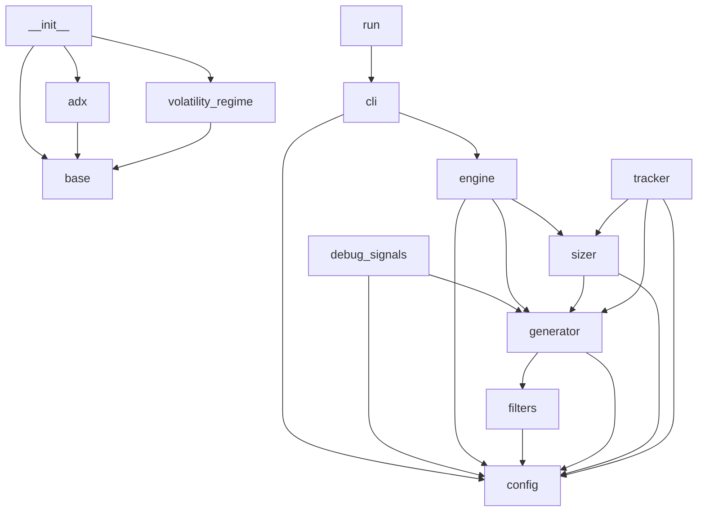

# Project Context

> **Auto-generated by [code-mapper](https://github.com/your-org/code-mapper).**  
> Read this file instead of scanning source files — it captures the full structure at a fraction of the token cost.
> `volatility_breakout` · 18 files (python×18) · 18 classes · 23 functions · ~1,257 source lines

---
## File Structure

```
volatility_breakout/
└── __init__.py
├── backtest/
  └── __init__.py
  └── engine.py
└── cli.py
└── config.py
└── debug_signals.py
├── indicators/
  └── __init__.py
  └── adx.py
  └── base.py
  └── volatility_regime.py
├── paper_trading/
  └── __init__.py
  └── db.py
  └── tracker.py
├── position_sizing/
  └── sizer.py
└── run.py
├── signals/
  └── __init__.py
  └── filters.py
  └── generator.py
```

## Class Diagram

```mermaid
classDiagram
    class ADX["ADX"] {
        +compute()
        +name()
        +__init__()
    }
    Indicator <|-- ADX : extends
    class ADXConfig["«dataclass» ADXConfig"] {
        +enabled: bool
        +period: int
        +min_adx: float
    }
    class Action["Action"] {
    }
    class BacktestConfig["«dataclass» BacktestConfig"] {
        +initial_capital: float
        +commission_per_trade: float
        +commission_pct: float
        +slippage: float
    }
    class BacktestResult["«dataclass» BacktestResult"] {
        +ticker: str
        +equity_curve: Series
        +trades_df: DataFrame
        +metrics: Dict
    }
    class BacktestSummary["«dataclass» BacktestSummary"] {
        +results: Dict
        +portfolio_equity: Optional
        +portfolio_metrics: Optional
    }
    class BreakoutConfig["«dataclass» BreakoutConfig"] {
        +enabled: bool
        +volume_mult: float
        +volume_length: int
        +vwap_filter: bool
    }
    class ExitConfig["«dataclass» ExitConfig"] {
        +trailing_ema_length: int
    }
    class FalseBreakoutConfig["«dataclass» FalseBreakoutConfig"] {
        +enabled: bool
        +max_bars: int
        +reversal_atr_mult: float
    }
    class Indicator["«abstract» Indicator"] {
        +compute()
        +signal_series()
        +name()
    }
    class IndicatorResult["«dataclass» IndicatorResult"] {
        +values: Series
        +raw: Optional
        +name: str
    }
    class PortfolioConstraintsConfig["«dataclass» PortfolioConstraintsConfig"] {
        +max_open_positions: int
        +max_sector_exposure_pct: float
        +max_gross_exposure_pct: float
        +adv_participation_pct: float
    }
    class PositionSizingConfig["«dataclass» PositionSizingConfig"] {
        +base_position_pct: float
        +max_position_pct: float
        +sentiment_agree_mult: float
        +sentiment_disagree_mult: float
    }
    class Signal["«dataclass» Signal"] {
        +ticker: str
        +date: str
        +action: Action
        +price: float
        +raw_strength: float
        +filtered_strength: float
    }
    class SignalConfig["«dataclass» SignalConfig"] {
        +sentiment_filter_enabled: bool
        +min_sentiment_confidence: float
        +block_on_negative_sentiment: bool
        +risk_filter_enabled: bool
    }
    class SqueezeConfig["«dataclass» SqueezeConfig"] {
        +enabled: bool
        +length: int
        +bb_std: float
        +kc_mult: float
    }
    class VolatilityBreakoutConfig["«dataclass» VolatilityBreakoutConfig"] {
        +squeeze: SqueezeConfig
        +breakout: BreakoutConfig
        +exits: ExitConfig
        +false_breakout: FalseBreakoutConfig
        +adx: ADXConfig
    }
    class VolatilityRegime["VolatilityRegime"] {
        +compute()
        +name()
        +__init__()
    }
    Indicator <|-- VolatilityRegime : extends
    class VolatilityRegimeConfig["«dataclass» VolatilityRegimeConfig"] {
        +enabled: bool
        +period: int
        +low_vol_threshold: float
        +high_vol_threshold: float
    }
```



## Module Dependencies



## Symbol Index


**`backtest\engine.py`** `python`
- `«dataclass» class BacktestResult`
- `«dataclass» class BacktestSummary`
- `def run_backtest(cfg: VolatilityBreakoutConfig, ticker_ohlc: Dict, benchmark_ohlc: Dict, rf_annual: float) → BacktestSummary`
- `def run_portfolio_backtest(cfg: VolatilityBreakoutConfig, ticker_ohlc: Dict, benchmark_ohlc: Dict, rf_annual: float) → BacktestSummary`  — Run a full portfolio-level backtest aggregating across all tickers.

**`cli.py`** `python`
- `def cmd_signals(args) → None`
- `def cmd_backtest(args) → None`
- `def cmd_paper(args) → None`
- `def cmd_positions(args) → None`
- `def main()`

**`config.py`** `python`
- `«dataclass» class SqueezeConfig`  — TTM Squeeze configuration: Bollinger Bands strictly inside Keltner Channels.
- `«dataclass» class BreakoutConfig`  — Breakout parameters.
- `«dataclass» class ExitConfig`  — Exit parameters.
- `«dataclass» class FalseBreakoutConfig`  — Post-entry filter to detect and exit failed breakouts early (max_bars, reversal_atr_mult).
- `«dataclass» class ADXConfig`  — Trend strength filter.
- `«dataclass» class VolatilityRegimeConfig`  — Volatility regime — scale down position size in high-vol periods.
- `«dataclass» class SignalConfig`  — Signal generation settings.
- `«dataclass» class PortfolioConstraintsConfig`
- `«dataclass» class PositionSizingConfig`  — Position sizing parameters.
- `«dataclass» class BacktestConfig`  — Backtest engine settings.
- `«dataclass» class VolatilityBreakoutConfig`  — Master configuration.

**`indicators\adx.py`** `python`
- `class ADX(Indicator)`  — Average Directional Index (ADX)
  methods: `compute`, `name`

**`indicators\base.py`** `python`
- `«dataclass» class IndicatorResult`
- `«abstract» class Indicator(ABC)`
  methods: `compute`, `signal_series`, `name`

**`indicators\volatility_regime.py`** `python`
- `class VolatilityRegime(Indicator)`  — Measures current volatility relative to recent history.
  methods: `compute`, `name`

**`paper_trading\db.py`** `python`
- `def init_db()`
- `def get_cash_balance() → float`
- `def update_cash_balance(amount: float)`
- `def has_run_today(date_str: str) → bool`
- `def mark_run_today(date_str: str)`
- `def get_positions() → List`
- `def upsert_position(ticker: str, shares: int, avg_cost: float, stop_loss: float)`
- `def remove_position(ticker: str)`
- `def log_trade(date_str: str, ticker: str, action: str, shares: int)`
- `def get_trades(limit: int) → List`

**`paper_trading\tracker.py`** `python`
- `def run_paper_trading(cfg: VolatilityBreakoutConfig)`

**`position_sizing\sizer.py`** `python`
- `def compute_position_dollars(sig: Signal, portfolio_nav: float, cfg: VolatilityBreakoutConfig, kelly_fraction: Optional) → float`  — Calculate the target dollar amount for a new position.
- `def shares_to_buy(sig: Signal, portfolio_nav: float, current_price: float, cfg: VolatilityBreakoutConfig) → int`  — Calculate number of shares to buy.

**`signals\filters.py`** `python`
- `def apply_vb_filters(ticker: str, sentiment_override: Optional, adx_val: Optional, cfg: VolatilityBreakoutConfig) → Tuple`  — Apply Volatility Breakout filters (trend, sentiment, risk).

**`signals\generator.py`** `python`
> VB signal generator with squeeze detection, breakout confirmation, and strength-based sizing.
- `class Action(str, Enum)`
- `«dataclass» class Signal`  — Includes `raw_strength`, `filtered_strength`, `adx_value`, `volume_ratio`, `vol_regime_mult` for harness strength-based allocation.
- `def compute_indicators(ohlc: DataFrame, cfg: VolatilityBreakoutConfig) → DataFrame`
- `def generate_signal(ticker: str, ohlc: DataFrame, cfg: VolatilityBreakoutConfig, sentiment_override: Optional) → Signal`